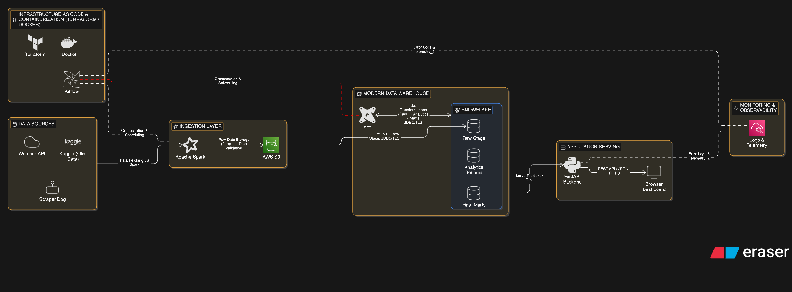
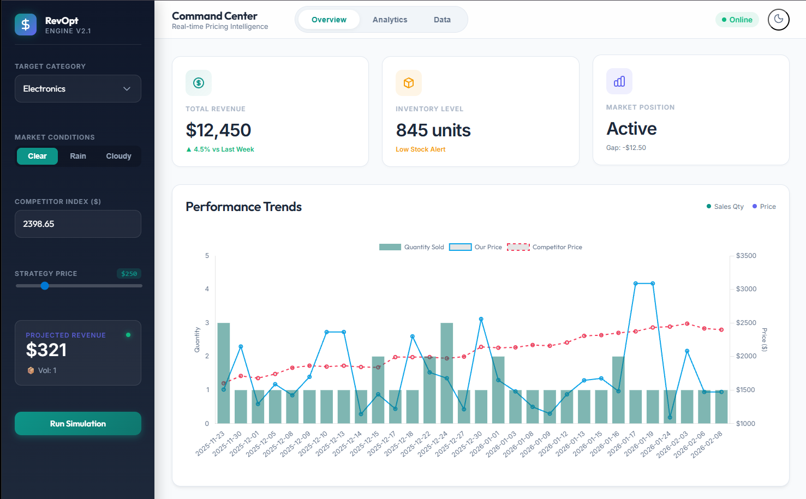
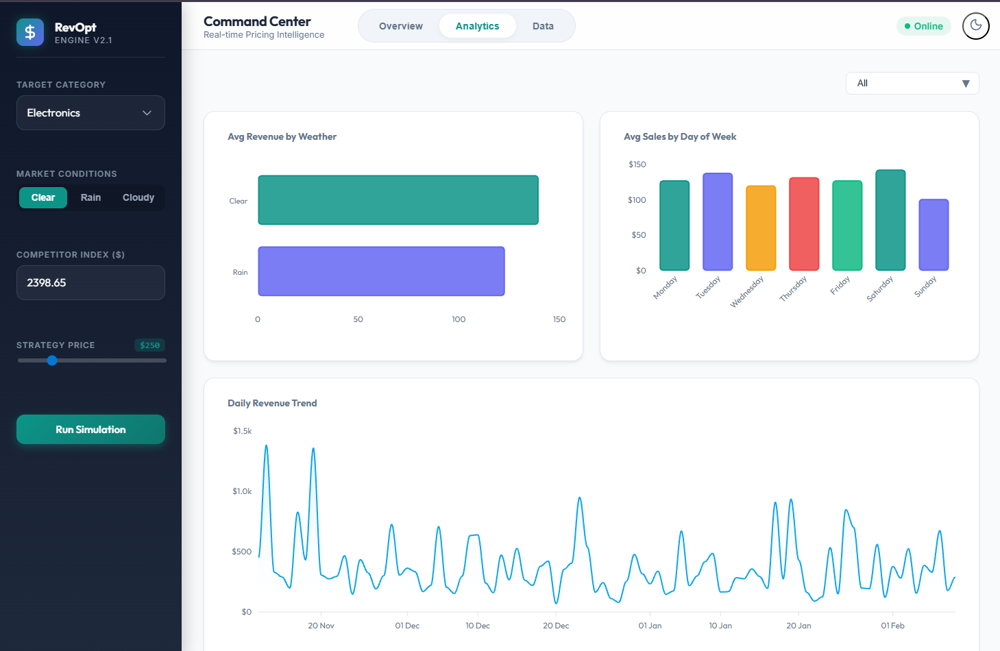
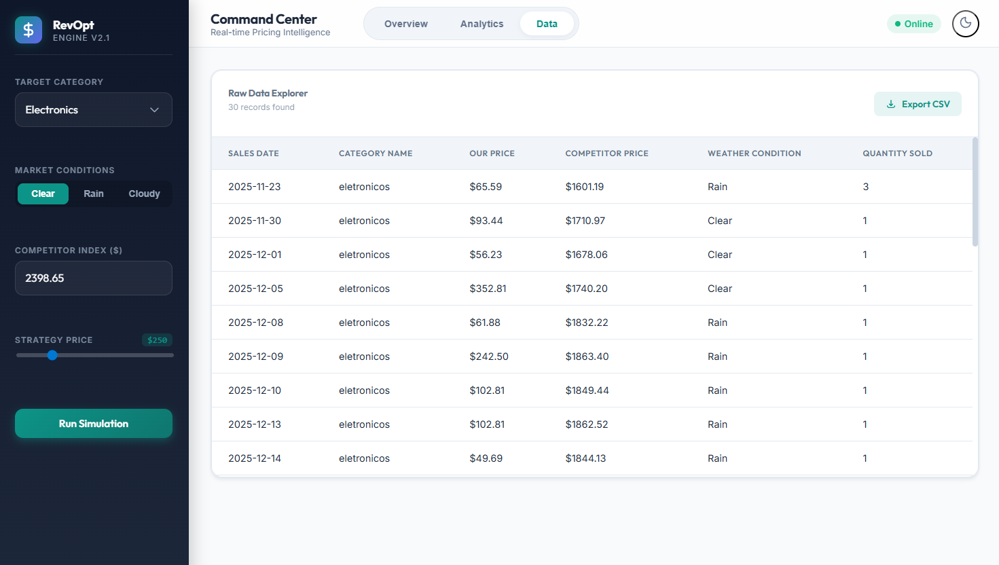
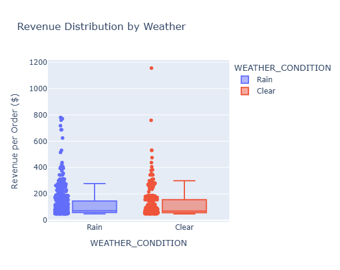
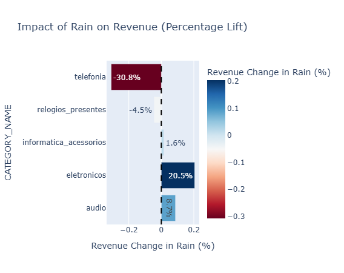

# Revenue Optimization Engine Data Platform


**An End-to-End Data Engineering & Predictive Analytics Platform**

## Table of Contents

* [Executive Summary](https://www.google.com/search?q=%23executive-summary)
* [Problem Statement](https://www.google.com/search?q=%23problem-statement)
* [Solution Architecture](https://www.google.com/search?q=%23solution-architecture)
* [Tech Stack](https://www.google.com/search?q=%23tech-stack)
* [Key Features & Innovations](https://www.google.com/search?q=%23key-features--innovations)
* [Project Structure](https://www.google.com/search?q=%23project-structure)
* [Data Source Overview](https://www.google.com/search?q=%23data-source-overview)
* [Component Deep Dive](https://www.google.com/search?q=%23component-deep-dive)
* [Data Transformation (dbt)](https://www.google.com/search?q=%23data-transformation-dbt)
* [Data Quality & Testing](https://www.google.com/search?q=%23data-quality--testing)
* [Insights & Visualizations](https://www.google.com/search?q=%23insights--visualizations)
* [Steps to Reproduce](https://www.google.com/search?q=%23steps-to-reproduce)
* [Future Roadmap](https://www.google.com/search?q=%23future-roadmap)
* [Contact Information](https://www.google.com/search?q=%23contact-information)

---

## Executive Summary

The **Revenue Optimization Engine** is a full-stack data platform engineered to solve the inefficiencies of static pricing in e-commerce. In a market where consumer demand fluctuates hourly due to external factors like weather and competitor moves, relied-upon "cost-plus" pricing strategies often leave money on the table.

This project integrates disparate data sources, historical sales records, real-time competitor pricing, and hyper-local weather forecasts, into a unified predictive model. By leveraging machine learning to understand demand elasticity, the system recommends optimal price points that maximize Total Revenue (GMV) while adhering to strict business guardrails.

The platform demonstrates a **complete data lifecycle**, from automated infrastructure provisioning (IaC) and batch ingestion to complex dbt transformations and a user-facing analytical dashboard that empowers category managers to simulate pricing scenarios in real-time.

---

## Problem Statement

In the highly competitive world of online retail, pricing strategies are often reactive, manual, or dangerously static. Retailers face a dual challenge: they miss out on revenue opportunities during high-demand periods (e.g., unexpected rain driving electronics sales) and lose market share during low-demand periods due to uncompetitive pricing.

Connecting these operational realities to data is difficult. Legacy sales data lives in SQL databases, competitor pricing is fleeting and requires web scraping, and weather data is unlocked via external APIs. The challenge was to build a robust pipeline that could ingest, unify, and model these diverse datasets to drive automated, intelligent decision-making.

---

## Solution Architecture

The system is built on a modern **Lakehouse Architecture**, designed to decouple storage, compute, and serving layers for maximum scalability and maintainability.



### 1. Extract (Ingestion Layer)
The data journey begins with the ingestion of three primary sources. **Olist E-Commerce Data** serves as the historical backbone, providing granular transaction details. We enrich this with **Weather API** data to capture environmental context and **ScraperDog** data to monitor real-time competitor pricing.

*   **Processing**: Distributed data fetching is handled by **Apache Spark**, which standardizes the raw data into Parquet format.
*   **Storage**: The data lands in **AWS S3**, acting as our "Bronze" Data Lake layer. This ensures that we always have a durable, immutable copy of the source data before any transformations are applied.

### 2. Load (Warehousing)
Data is then loaded into **Snowflake**, our central data warehouse. We utilize **Storage Integrations** to securely connect Snowflake to AWS S3 without hardcoding credentials. This separates the raw ingestion layer (`RAW` schema) from the business logic layer, allowing for cleaner governance and easier auditing.

### 3. Transform (dbt & Logic)
Transformation is managed by **dbt (data build tool)**, which serves as the "T" in our ELT pipeline. This is where the raw data is cleaned, tested, and modeled.
*   **The "Time Travel" Transformation**: A critical custom logic layer shifts historical 2017 transaction timestamps forward by ~2,800 days. This allows us to overlay 2017 behavioral patterns onto 2026 calendar dates, enabling the model to train on "past" behavior while reacting to "current" weather and competitor prices.
*   **One-Big-Table (OBT)**: We denormalize the normalized 3NF schema into a single, wide training dataset. This joins Sales, Weather, and Competitor Benchmarks, creating a high-performance table optimized for Machine Learning.

### 4. Machine Learning & Serving
The core intelligence engine is an **XGBoost Regressor** trained on the OBT. The model's objective is to predict `Quantity_Sold` based on features like `Price`, `Competitor_Price_Ratio`, `Weather_Condition`, and `Seasonality`.
*   **Serving**: The model is exposed via a **FastAPI** backend, which provides REST endpoints for real-time predictions and access to historical analytics data.

### 5. Visualize (Application Layer)
The final interface is a reactive **Reflex** Single Page Application (SPA). This dashboard allows category managers to visualize the model's recommendations, simulate different pricing strategies, and monitor key performance indicators (KPIs) like Revenue Lift and Price Elasticity.

---

## Tech Stack

| Domain | Technology | Usage |
| --- | --- | --- |
| **Language** | Python 3.10+ | Core logic, ML, Scripting |
| **Cloud** | AWS (S3) | Object Storage / Data Lake |
| **Warehouse** | Snowflake | Storage, Compute, SQL Transformation |
| **Transformation** | dbt Core | Modeling, Testing, Lineage |
| **Orchestration** | Apache Airflow | Workflow Management |
| **Infrastructure** | Terraform | Infrastructure as Code |
| **Machine Learning** | XGBoost, Scikit-Learn | Predictive Modeling |
| **API Framework** | FastAPI | Model Serving & Data Access |
| **Frontend** | Reflex | Interactive Dashboard |

---

## Key Features & Innovations

### 🌦️ The "Storm Surge" Engine
During Exploratory Data Analysis (EDA), we uncovered a strong correlation between precipitation and specific product categories, most notably, a **+20.5% lift in Electronics sales during rainy days**. The engine is designed to detect "Rain" in the weather forecast and automatically adjusts the recommended margin to capture this high-intent demand, optimizing revenue without sacrificing volume.

### Temporal Data Shifting
One of the biggest challenges in Using public datasets is their age. To bridge the gap between high-quality open-source data (Olist, 2017) and the need for modern context (Live Competitor Prices, 2026), the pipeline implements a robust date-shifting algorithm. This allows the system to **simulate realistic 2026 market scenarios** using validated behavioral patterns from the past.

### Economic Guardrails
Unlike generic ML models that blindly minimize error, this engine prioritizes business safety. We apply **monotonic constraints** to the XGBoost estimator to enforce the economic law of demand. This guarantees that the model never recommends a price hike that would theoretically increase sales volume, a common "hallucination" in unconstrained models that destroys trust with business stakeholders.

---

## Project Structure

```text
revenueOptimizationEngine/
├── assets/                   # Project images and visualizations
├── backend/                  # FastAPI Application
│   └── app/
│       ├── main.py           # API Entrypoint
│       └── schemas.py        # Pydantic Models
├── dags/                     # Airflow DAGs
│   └── daily_pricing_pipeline.py
├── frontend/                 # Reflex Frontend
│   └── frontend.py           # UI Logic
├── infrastructure/           # Terraform IaC
│   ├── snowflake/            # Snowflake Resources
│   └── terraform/            # AWS Resources
├── notebooks/                # Jupyter Notebooks for EDA & ML
│   └── ml_training.ipynb
├── scripts/                  # SQL Scripts for Ingestion
│   ├── 01_snowflake_setup.sql
│   └── 02_ingest_core_data.sql
├── transformation/           # dbt Project
│   ├── models/               # Staging & Marts
│   └── dbt_project.yml
└── docker-compose.yml        # Airflow & Service Orchestration
```

### Folder Highlights
*   **`infrastructure/`**: Fully automates the deployment of the Cloud environment. This ensures that our S3 buckets and Snowflake warehouses are provisioned identically across development and production environments using Terraform.
*   **`transformation/`**: Houses the dbt project where raw data is modeled into business-ready dimensions and facts. This includes the logic for the "Time Travel" shift and the creation of the ML training dataset.
*   **`backend/`**: Contains the FastAPI application that serves the ML model and data to the frontend. It enforces strict data contracts using Pydantic schemas.
*   **`frontend/`**: The Reflex-based UI code for the interactive dashboard, providing a seamless user experience for pricing analysts.

---

## Data Source Overview

The platform integrates three distinct data sources to create a holistic view of the market.

### 1. Olist E-Commerce Data
This is a comprehensive dataset of 100k orders made at Olist Store in Brazil. It provides the foundational "truth" for how customers behave.
*   **Content**: Order status, price, payment, freight performance, customer location, and product attributes.
*   **Role**: It serves as the historical backbone for training demand models, allowing us to learn baseline elasticity for thousands of products.

### 2. Weather API
We integrate historical and forecast weather data for key logistics hubs to understand environmental drivers of demand.
*   **Content**: Temperature, precipitation, and precise weather conditions (Rain, Clear, Cloudy).
*   **Role**: Used to identify weather-correlated demand surges (The "Storm Surge" Engine), allowing the model to react to non-price factors.

### 3. Competitor Pricing (ScraperDog)
Real-time pricing data is fetched from major competitor marketplaces to provide market context.
*   **Content**: Product ASIN, Price, Seller, and Availability.
*   **Role**: This provides the `Competitor_Price` feature, which is essential for calculating price ratios. Knowing if we are cheaper or more expensive than the market is the single most important factor in predicting conversion.

---

## Component Deep Dive

Here are the critical components of the platform, showcasing the engineering rigor across the stack.

### 1. Infrastructure as Code (Terraform & Snowflake)
*What this shows: Automated, reproducible, and secure cloud environment provisioning.*

**Managing Snowflake Resources via Terraform**  
*File: `infrastructure/snowflake/03_snowflake_infrastructure.tf`*
```hcl
# Automating the Data Warehouse creation to ensure environment consistency
resource "snowflake_warehouse" "compute_wh" {
  name           = "COMPUTE_WH"
  warehouse_size = "x-small"
  auto_suspend   = 60
  auto_resume    = true
  comment        = "Main compute resource for ingestion and dbt models."
}

resource "snowflake_schema" "raw_schema" {
  database = snowflake_database.db.name
  name     = "RAW"
  comment  = "Landing zone for immutable source data."
}
```

**Secure S3 Integration (The "Handshake")**  
*File: `scripts/01_snowflake_infrastructure_setup.sql`*
```sql
-- Security Best Practice: Using Storage Integrations instead of hardcoded AWS Keys
CREATE OR REPLACE STORAGE INTEGRATION s3_int
  TYPE = EXTERNAL_STAGE
  STORAGE_PROVIDER = 'S3'
  ENABLED = TRUE
  STORAGE_AWS_ROLE_ARN = 'arn:aws:iam::982081062053:role/Snowflake_S3_Connection_Role'
  STORAGE_ALLOWED_LOCATIONS = ('s3://de-project-dynamic-pricing-raw-source/');
```

### 2. Advanced Data Engineering (SQL & Logic)
*What this shows: Handling complex transformations and solving business logic challenges.*

**The "Time Travel" Shift**  
*File: `scripts/02_ingest_core_data.sql`*
```sql
-- Transforming 2017 data to simulate a "Live" 2026 environment
CREATE OR REPLACE VIEW DYNAMIC_PRICING.RAW.orders_current AS
SELECT 
    order_id,
    customer_id,
    order_status,
    -- CRITICAL: Shift dates forward by ~8 years to align historical sales 
    -- with current real-time competitor scraping and weather forecasts.
    DATEADD(day, 2800, order_purchase_timestamp) as order_purchase_timestamp
FROM DYNAMIC_PRICING.RAW.orders;
```

**Pattern-Based Ingestion (Data Lake Loading)**  
*File: `scripts/02_ingest_core_data.sql`*
```sql
-- Efficiently loading partitioned data from S3 using Regex patterns
COPY INTO DYNAMIC_PRICING.RAW.orders
FROM @olist_pricing_stage
PATTERN = '.*orders.*.csv' 
FILE_FORMAT = (TYPE = 'CSV', SKIP_HEADER = 1, FIELD_OPTIONALLY_ENCLOSED_BY = '"')
ON_ERROR = 'CONTINUE'; -- Fault tolerance for bad records
```

### 3. Machine Learning (XGBoost & Feature Engineering)
*What this shows: Building "Business Safe" models with economic guardrails.*

**Feature Engineering & Monotonic Constraints**  
*File: `notebooks/ml_training.ipynb`*
```python
# Capturing the "Storm Surge" hypothesis
# (Does Rain + Electronics = Higher Sales?)
df['RAIN_X_ELECTRONICS'] = df.apply(
    lambda x: 1 if x['WEATHER_CONDITION'] == 'Rain' and x['CATEGORY_NAME'] == 'eletronicos' else 0, axis=1
)

# CRITICAL: Forcing the model to obey economic laws.
# "As Price goes UP, Demand must go DOWN (or stay flat)."
model = XGBRegressor(
    objective='reg:squarederror',
    n_estimators=200,
    monotone_constraints='(-1, -1)' # Enforces negative correlation for Price features
)
```

### 4. Backend Engineering (FastAPI)
*What this shows: Deploying scalable, strictly-typed microservices.*

**Strict Data Contracts (Pydantic)**  
*File: `backend/app/schemas.py`*
```python
# Defining the API Contract to prevent bad data from crashing the model
class PricingScenario(BaseModel):
    category: str = Field(..., example="eletronicos")
    weather: Literal['Clear', 'Rain', 'Cloudy']
    our_price: float = Field(..., gt=0, description="Price must be positive")
    competitor_price: float = Field(..., gt=0)
    
    @validator('category')
    def category_must_exist(cls, v):
        if v not in VALID_CATEGORIES:
            raise ValueError(f"Unknown category: {v}")
        return v
```

**Efficient Model Loading (System Design)**
*File: `backend/app/main.py`*
```python
# Loading the model ONCE at startup (Global State) 
# instead of reloading it for every request (Latency Killer)
@app.on_event("startup")
def load_artifacts():
    global model_pipeline, historical_data
    if os.path.exists(MODEL_PATH):
        model_pipeline = joblib.load(MODEL_PATH)
        print("Brain loaded: XGBoost Pipeline ready.")
```

### 5. Frontend Engineering (Reflex)
*What this shows: Full-stack capabilities for building internal tools.*

**Interactive Visualization**  
*File: `frontend/frontend.py`*
```python
# Rendering the History vs. Competitor Price Chart
rx.recharts.line_chart(
    rx.recharts.line(data_key="OUR_PRICE", stroke="#8884d8"),
    rx.recharts.line(data_key="COMPETITOR_PRICE", stroke="#82ca9d"),
    rx.recharts.x_axis(data_key="SALES_DATE"),
    rx.recharts.tooltip(),
    data=State.chart_data, 
    width="100%",
)
```

---

## Data Transformation (dbt)

The transformed data is modeled into a Star Schema within Snowflake, ensuring high-performance querying for the analytics layer. This lineage graph illustrates the flow from raw source tables, through distinct staging layers, and finally into the aggregated marts used for reporting.


*Above: The full lineage graph showing the flow from raw tables to the final `mart_full_sales_log`.*

---

## Data Quality & Testing

Ensuring data reliability is paramount, especially when handling financial decisions. We implement a multi-layered testing strategy:

### 1. Schema Validation (Pydantic)
*   **Strict Typing:** The backend acts as a gatekeeper, enforcing data types for all API inputs using Pydantic models.
*   **Validation Rules:** Logic rules, such as ensuring `price` is positive and `category` matches known inventory, prevent bad data from ever reaching the model.

### 2. Model Guardrails (XGBoost)
*   **Monotonicity:** We enforce `(-1, -1)` constraints on price features. This hard-codes the economic reality that as price increases, demand should generally decrease or stay flat, preventing the model from making nonsensical high-price recommendations.

### 3. Infrastructure Validation (Terraform)
*   **State Management:** Terraform maintains the state of cloud resources, preventing "configuration drift" where the live environment silently diverges from the code definition.
*   **Code Review:** All infrastructure changes are defined in HCL code, allowing for peer review and version control before deployment.

---

## Insights & Visualizations

The platform provides a comprehensive user interface for exploring data and simulating pricing strategies.

### 1. Dashboard Overview
The command center provides a high-level view of key metrics, including total revenue, active alerts, and system health. It serves as the starting point for any pricing analyst.



### 2. Analytics & Trends
This tab allows for a deep dive into performance metrics. Analysts can compare "Our Price" vs "Competitor Price" over simulated time sequences to identify periods where we were over-priced or leaving money on the table.



### 3. Data Explorer
Transparency is key to trust. The Data Explorer provides a raw view of the underlying data, allowing users to inspect individual records, sort by different metrics, and export data for further ad-hoc analysis in Excel or other tools.



### 4. Revenue Distribution
Analyzing the contribution of different product categories to the total GMV reveals which segments are the primary drivers of business value.



### 5. The Impact of Weather
We observed a significant revenue lift in specific categories during rainy conditions. This chart visualizes that correlation, validating the "Storm Surge" hypothesis.



---

## Steps to Reproduce

This section provides a detailed guide to deploying the Revenue Optimization Engine from scratch.

### 1. Prerequisites & Environment Setup
Before beginning, ensure your local environment meets the following requirements:
*   **Snowflake Account**: A valid account with `ACCOUNTADMIN` access to create warehouses and databases.
*   **AWS Account**: Credentials with permissions to manage S3 buckets and IAM roles.
*   **Local Tools**: Terraform, Docker Desktop, Python 3.10+, and Node.js (if you plan to modify the frontend build).

### 2. Infrastructure as Code (Terraform)
Provision the core Cloud and Snowflake components using Terraform. This ensures your environment matches the production spec exactly.

1.  Navigate to the infrastructure directory: `cd infrastructure`
2.  Initialize Terraform to download providers: `terraform init`
3.  Apply the configuration:
    ```bash
    terraform plan
    terraform apply -auto-approve
    ```
4.  **Note:** This command will output your specific Snowflake Warehouse IDs and S3 Bucket names. Keep these for the next steps.

### 3. Data Pipeline Execution (Airflow & dbt)
Run the ingestion and transformation pipelines to populate your warehouse.

1.  Start the Airflow orchestration layer: `docker-compose up -d`
2.  Trigger the `daily_pricing_pipeline` DAG in the Airflow UI (accessible at `localhost:8080`).
3.  Once data is loaded, execute the dbt transformations to build the data marts:
    ```bash
    cd transformation
    dbt deps
    dbt run
    ```

### 4. Model Training
Train the pricing model using the freshly ingested and transformed data.

1.  Open the training notebook: `jupyter notebook notebooks/ml_training.ipynb`
2.  Run all cells. This process will:
    *   Fetch training data from Snowflake.
    *   Perform feature engineering (including lag features and ratios).
    *   Train the XGBoost model with monotonic constraints.
    *   Save the trained artifact as `revenue_model.pkl`.

### 5. Launch Application
Start the Backend and Frontend services to interact with your model.

1.  **Backend (FastAPI)**:
    ```bash
    uvicorn backend.app.main:app --reload
    ```
2.  **Frontend (Reflex)**:
    ```bash
    reflex run
    ```
3.  Access the full dashboard at `http://localhost:3000`.

---

## Future Roadmap

* **A/B Testing Module:** Implement a feedback loop to compare model recommendations against a control group (manual pricing) in a live production environment.
* **Real-time Streaming:** Upgrade the ingestion layer from batch (Airflow) to streaming (Kafka/Snowpipe) to allow the model to react to competitor price changes in seconds, not hours.
* **Kubernetes Deployment:** Migrate the serving layer from local Docker containers to Amazon EKS for scalable, high-availability model serving.

---

## Contact Information

Feel free to reach out if you have any questions about the architecture, the tech stack, or potential collaborations!

* **Name:** Avirukth Thadaklur
* **Email:** [avirukth@gmail.com](mailto:avirukth@gmail.com)
* **LinkedIn:** [linkedin.com/in/avirukth-thadaklur/](https://www.linkedin.com/in/avirukth-thadaklur/)
* **Project Portfolio:** [GitHub Profile](https://github.com/avirukthgt)
