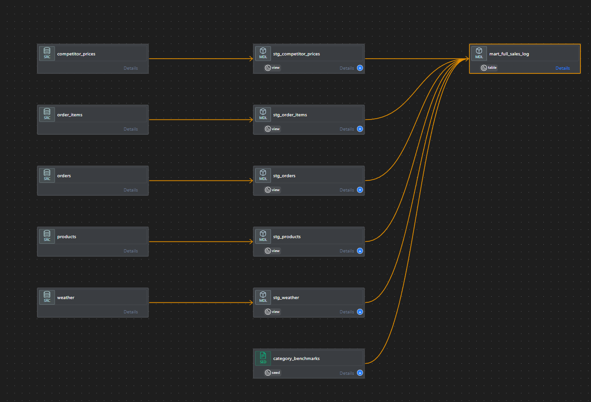

# Revenue Optimization Engine: Data Transformation Layer (dbt)

This directory contains the **dbt (data build tool)** project responsible for transforming raw data into business-ready analytical models. It serves as the "T" in our ELT pipeline, ensuring data quality, consistency, and traceability.



## Overview

The transformation layer is designed using a modular architecture:
1.  **Staging (`stg_`)**: 1:1 views of raw data with light cleaning (casting types, renaming columns).
2.  **Marts (`mart_`)**: Business-logic heavy tables that join staging models to answer specific questions.

### Key Logic: The "Time Travel" Shift ⏳
A critical component of this project is the **Temporal Shift Logic**. Since our primary training dataset (Olist) is from 2017-2018, we apply a consistent date offset (`+2800 days`) to align historical transaction patterns with current (2025/2026) competitor pricing and weather data. This allows us to simulate a "live" pricing engine using high-quality historical behavioral data.

---

## Project Structure

```text
transformation/
├── models/
│   ├── staging/          # Raw -> Cleaned 1:1 views
│   │   ├── stg_orders.sql
│   │   ├── stg_items.sql
│   │   └── stg_weather.sql
│   └── marts/            # Cleaned -> Business Logic (Star Schema)
│       ├── mart_full_sales_log.sql  # The OBT (One Big Table) for ML
│       └── mart_daily_sales.sql     # Aggregated view for Dashboard
├── tests/                # Custom Data Quality Tests
├── macros/               # Reusable SQL logic
└── dbt_project.yml       # Project configuration
```

## Models Deep Dive

### 1. Staging Layer
*   **`stg_orders`**: detailed order information including timestamps and status.
*   **`stg_order_items`**: Line-item details (price, freight, product attributes).
*   **`stg_products`**: Product metadata (category, dimensions, weight).
*   **`stg_weather`**: Cleaning and standardizing weather API responses.

### 2. Marts Layer (The "Gold" Layer)
*   **`mart_full_sales_log`**: The core dataset for Machine Learning.
    *   **Grain**: One row per order item.
    *   **Enrichment**: Joins Orders + Items + Products + Weather + Competitor Prices.
    *   **Calculations**: Derives `price_ratio`, `is_holiday`, and `weather_condition`.
*   **`mart_daily_sales`**: Aggregated metrics for the Analytics Dashboard.
    *   **Grain**: One row per Category per Day.
    *   **Metrics**: Total Revenue, Total Quantity, Average Price, Competitor Price.

---

## Data Quality & Testing

We employ rigorous testing to ensure trust in the data.

### Generic Tests
Defined in `schema.yml` files:
*   **`unique`**: Primary keys (e.g., `order_id`) must be unique.
*   **`not_null`**: Critical fields (e.g., `price`, `timestamp`) cannot be null.
*   **`accepted_values`**: Status fields must match known values (e.g., `delivered`, `shipped`).

### Custom Logic Tests
*   **Sales Date Validity**: Ensures no sales dates are in the future (beyond the simulation window).
*   **Price Positivity**: Validates that all active products have a price > 0.
*   **Referential Integrity**: Ensures all `order_items` link to a valid `order` and `product`.

---

## Setup & Execution

### Prerequisites
*   **dbt Core**: Installed via `pip install dbt-snowflake`.
*   **Snowflake Account**: Configured in `~/.dbt/profiles.yml`.

### Running the Project

1.  **Install Dependencies**:
    ```bash
    dbt deps
    ```

2.  **Seed Static Data** (if applicable):
    ```bash
    dbt seed
    ```

3.  **Run Models**:
    ```bash
    dbt run
    ```
    *   Run specific model: `dbt run --select mart_full_sales_log`
    *   Run full lineage: `dbt run --select +mart_full_sales_log`

4.  **Test Data**:
    ```bash
    dbt test
    ```

5.  **Generate Documentation**:
    ```bash
    dbt docs generate
    dbt docs serve
    ```

---

## Lineage Graph

The following graph illustrates the data flow from raw sources to the final analytical marts.


---

## Contact
For questions regarding the data transformation logic, please see the contact info in the main project `README.md`.
